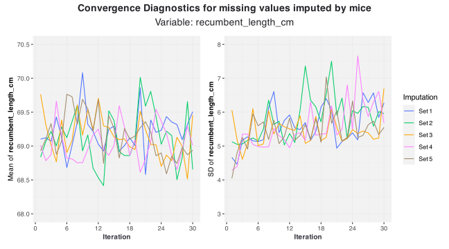
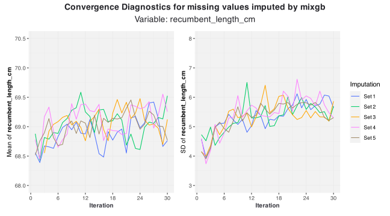

# Convergence Diagnostics for Multiple Imputation

## Obtain imputation objects from mice and mixgb

For demonstration, we use the `newborn` dataset included in the
**vismi** package. This is an incomplete dataset with missing values in
variables of various types.

We first obtain imputation objects from both the **mice** and **mixgb**
packages with 5 multiple imputations (`m = 5`) and 10 iterations
(`maxit = 10`).

``` r
library(vismi)
library(mice)
library(mixgb)


set.seed(2026)
mice_obj <- mice(data = newborn, m = 5, maxit = 30, printFlag = FALSE)
mixgb_obj <- mixgb(data = newborn, m = 5, maxit = 30, save.models = TRUE)
mixgb_pmm_obj <- mixgb(data = newborn, m = 5, maxit = 30, pmm.type = "auto",
    save.models = TRUE)
```

### Visualise convergence diagnostic for mice object

``` r
vismi_converge(obj = mice_obj, x = "recumbent_length_cm", tick_vals = NULL,
    linewidth = 0.5, mean_lim = c(68, 70.5), sd_lim = c(3, 8))
```



### Visualise convergence diagnostic for mixgb object (with PMM)

``` r
vismi_converge(obj = mixgb_pmm_obj, x = "recumbent_length_cm",
    tick_vals = NULL, linewidth = 0.5, mean_lim = c(68, 70.5),
    sd_lim = c(3, 8))
```



### Visualise convergence diagnostic for mixgb object (without PMM)

``` r
vismi_converge(obj = mixgb_obj, x = "recumbent_length_cm", tick_vals = NULL,
    linewidth = 0.5, mean_lim = c(68, 70.5), sd_lim = c(3, 8))
```


> **Convergence diagnostic for mixgb object**
>
> To use [`vismi_converge()`](../reference/vismi_converge.md) for
> **mixgb** object, users are required to set `save.models = TRUE` in
> [`mixgb()`](https://agnesdeng.github.io/mixgb/reference/mixgb.html) so
> that intermediate summary statistics for imputations would be saved at
> each iteration for plotting convergence diagnostics.
