# Visualisation for Overimputation Diagnostics

## Obtain overimputation objects

For demonstration, we use the `newborn` dataset included in the
**vismi** package. This is an incomplete dataset with missing values in
variables of various types.

We can obtain an overimputation object with 5 multiple imputations
(`m = 5`), extra missing values with proportion 20% (`p = 0.2`) and test
set ratio 20% (`test_ratio = 0.2`). Imputation method can be set to
`"mixgb"` or `"mice"`, which would call
[`mixgb()`](https://rdrr.io/pkg/mixgb/man/mixgb.html) or `mice` in the
backend. Users can also pass additional argument related to
[`mixgb()`](https://rdrr.io/pkg/mixgb/man/mixgb.html) or
[`mice()`](https://amices.org/mice/reference/mice.html) through
[`overimp()`](../reference/overimp.md).

Under this setting, 20% extra missing values will be introduced and data
will be split into training data (80%) and test data (20%). An
imputation model would be built using only training data, and it will be
used to impute the extra missing values in both the training data and
the test data.

``` r
library(vismi)
obj <- overimp(data = newborn, m = 5, p = 0.2, test_ratio = 0.2,
    method = "mixgb")
```

## Visual diagnostic for overimputation

### 1D visualisation

#### Numeric variable

The options for a numeric variable include: `cv`, `density`, `ridge`,
`qq`, and `qqline`.

``` r
vismi_overimp(obj = obj, x = "head_circumference_cm", num_plot = "cv")
```

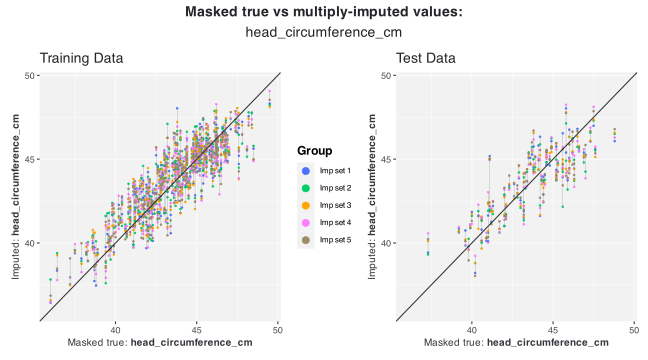

``` r
vismi_overimp(obj = obj, x = "head_circumference_cm", num_plot = "density")
```

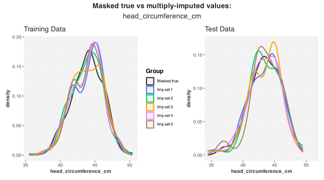

``` r
vismi_overimp(obj = obj, x = "head_circumference_cm", num_plot = "ridge")
```

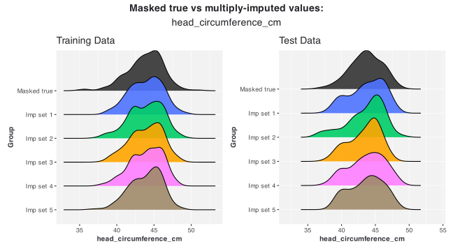

``` r
vismi_overimp(obj = obj, x = "head_circumference_cm", num_plot = "qq")
```

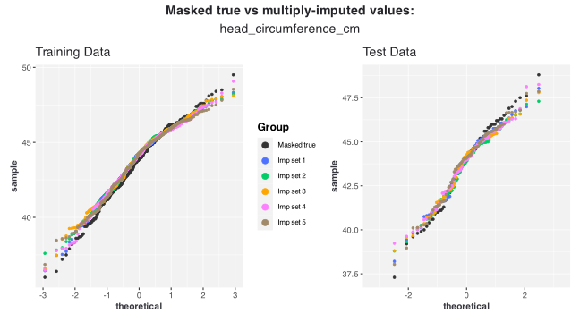

``` r
vismi_overimp(obj = obj, x = "head_circumference_cm", num_plot = "qqline")
```

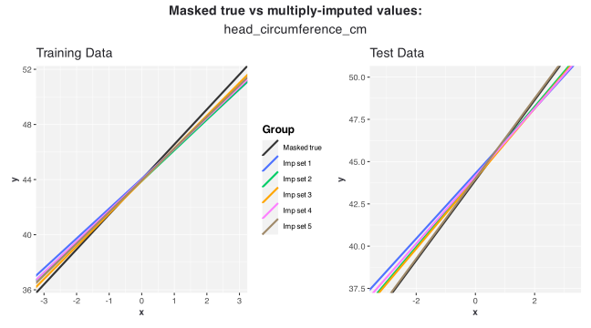

#### factor variable

The options for a factor variable include: `cv`, `bar`, `dodge`.

``` r
vismi_overimp(obj = obj, x = "ethnicity", fac_plot = "cv")
```

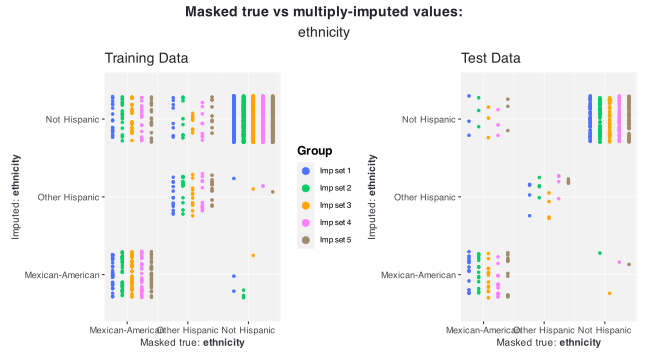

``` r
vismi_overimp(obj = obj, x = "ethnicity", fac_plot = "cv", stack_y = TRUE)
```

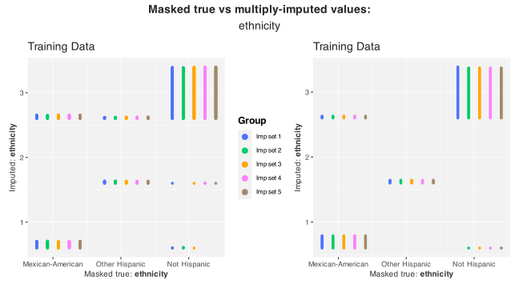

``` r
vismi_overimp(obj = obj, x = "ethnicity", fac_plot = "cv", stack_y = TRUE,
    diag_color = "white")
```

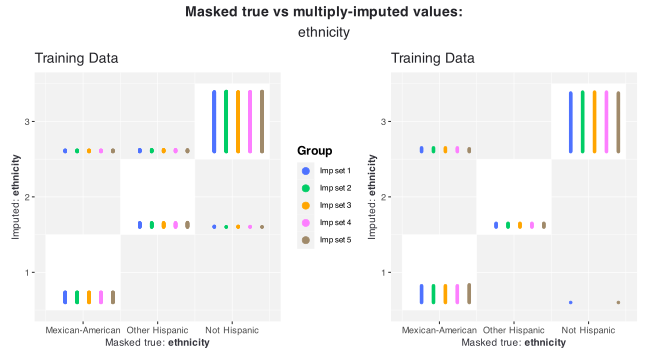

``` r
vismi_overimp(obj = obj, x = "health", fac_plot = "bar")
```

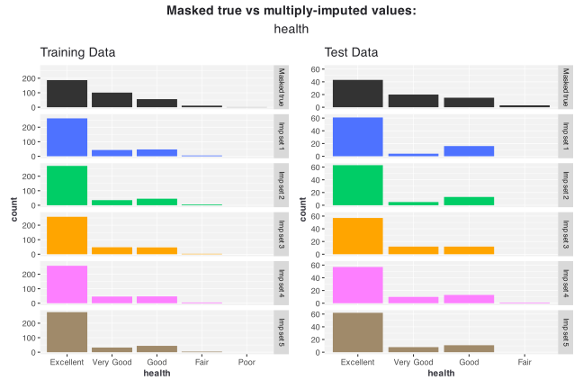

``` r
vismi_overimp(obj = obj, x = "health", fac_plot = "dodge")
```


### 2D visualisation

#### 2 numeric variables

``` r
vismi_overimp(obj = obj, x = "head_circumference_cm", y = "recumbent_length_cm")
```

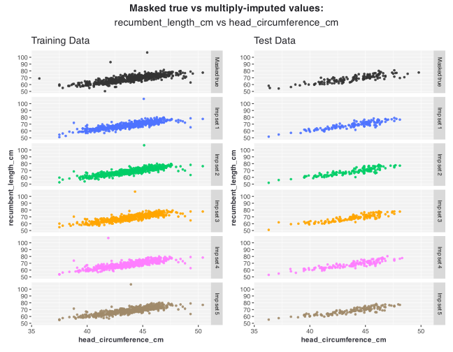

#### 1 factor 1 numeric variables

``` r
vismi_overimp(obj = obj, y = "sex", x = "head_circumference_cm",
    alpha = 0.5, point_size = 0.2, boxpoints = "all")
```

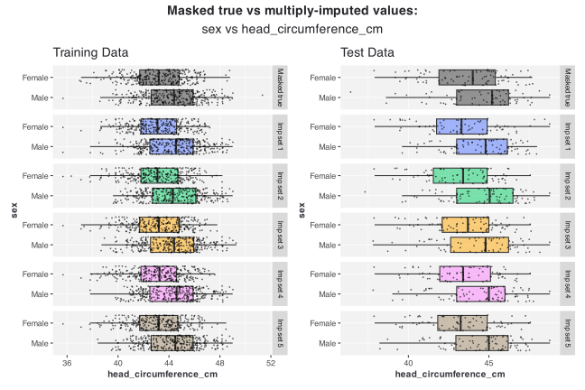

#### 2 factor variables

``` r
vismi_overimp(obj = obj, x = "health", y = "sex")
```

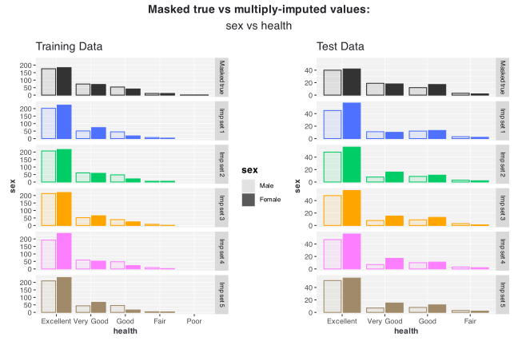
